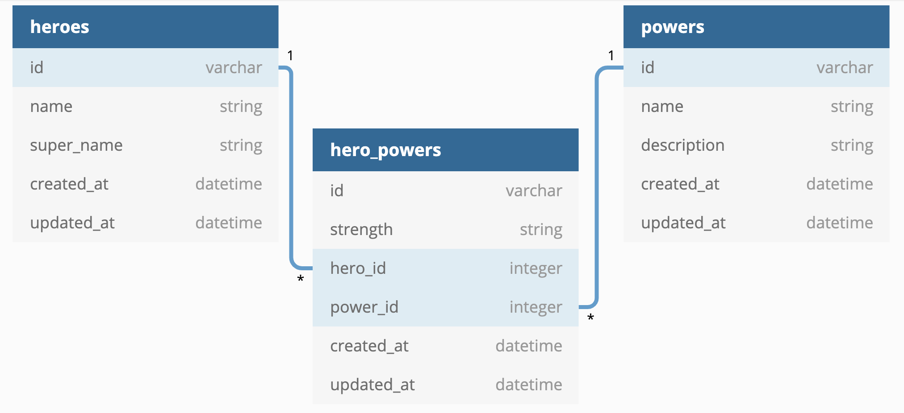

# Phase 4 Code Challenge: Superheroes
***
this is a simple rails api with thw folloeing resources

## Table structures and relationships
### Table structures



### Table relationsips
* A `Hero` has many `Power`s through `HeroPower`
* A `Power` has many `Hero`s through `HeroPower`
* `HeroPower` belongs to a `Hero` and belongs to a `Power`

## Validations
*  `strength` must be one of the following values: 'Strong', 'Weak', 'Average'
* Add validations to the `Power` model:
`description` must be present and at least 20 characters long
## Routes
***
* ```GET /heroes```

Return JSON data in the format below:

```
[  

{ "id": 1, "name": "Kamala Khan", "super_name": "Ms. Marvel" },  

{ "id": 2, "name": "Doreen Green", "super_name": "Squirrel Girl" },  

{ "id": 3, "name": "Gwen Stacy", "super_name": "Spider-Gwen" }

]
```

***
* ```GET /heroes/:id```

If the `Hero` exists, return JSON data in the format below:

```
{
  "id": 1,
  "name": "Kamala Khan",
  "super_name": "Ms. Marvel",
  "powers": [
    {
      "id": 1,
      "name": "super strength",
      "description": "gives the wielder super-human strengths"
    },
    {
      "id": 2,
      "name": "flight",
      "description": "gives the wielder the ability to fly through the skies at supersonic speed"
    }
  ]
}
```

If the `Hero` does not exist, return the following JSON data, along with
the appropriate HTTP status code:

```
{   "error": "Hero not found" }
```
***
* ```GET /powers```

Return JSON data in the format below:

```
[
  {
    "id": 1,
    "name": "super strength",
    "description": "gives the wielder super-human strengths"
  },
  {
    "id": 1,
    "name": "flight",
    "description": "gives the wielder the ability to fly through the skies at supersonic speed"
  }
]
```
***
* ```GET /powers/:id```

If the `Power` exists, return JSON data in the format below:

```
{
  "id": 1,
  "name": "super strength",
  "description": "gives the wielder super-human strengths"
}
```

If the `Power` does not exist, return the following JSON data, along with
the appropriate HTTP status code:

```
{
  "error": "Power not found"
}
```
***
* ```PATCH /powers/:id```

This route should update an existing `Power`. It should accept an object with
the following properties in the body of the request:

```
{
  "description": "Updated description"
}
```

If the `Power` exists and is updated successfully (passes validations), update
its description and return JSON data in the format below:

```
{
  "id": 1,
  "name": "super strength",
  "description": "Updated description"
}
```

If the `Power` does not exist, return the following JSON data, along with
the appropriate HTTP status code:

```
{
  "error": "Power not found"
}
```

If the `Power` is **not** updated successfully (does not pass validations),
return the following JSON data, along with the appropriate HTTP status code:

```
{
  "errors": ["validation errors"]
}
```
***
* ```POST /hero_powers```

This route should create a new `HeroPower` that is associated with an
existing `Power` and `Hero`. It should accept an object with the following
properties in the body of the request:

```
{
  "strength": "Average",
  "power_id": 1,
  "hero_id": 3
}
```

If the `HeroPower` is created successfully, send back a response with the data
related to the `Hero`:

```
{
  "id": 1,
  "name": "Kamala Khan",
  "super_name": "Ms. Marvel",
  "powers": [
    {
      "id": 1,
      "name": "super strength",
      "description": "gives the wielder super-human strengths"
    },
    {
      "id": 2,
      "name": "flight",
      "description": "gives the wielder the ability to fly through the skies at supersonic speed"
    }
  ]
}
```

If the `HeroPower` is **not** created successfully, return the following
JSON data, along with the appropriate HTTP status code:

```
{
  "errors": ["validation errors"]
}
```
***
### Troubleshooting
* rails automatic plurlize methowas as follows:
```ruby
'hero'.pluralize
#=> heros
```
to correct this, I updated config/initializers/inflections.rb to include
```ruby
ActiveSupport::Inflector.inflections(:en) do |inflect|
  inflect.irregular 'hero', 'heroes'
end
```
then completed the migrations


